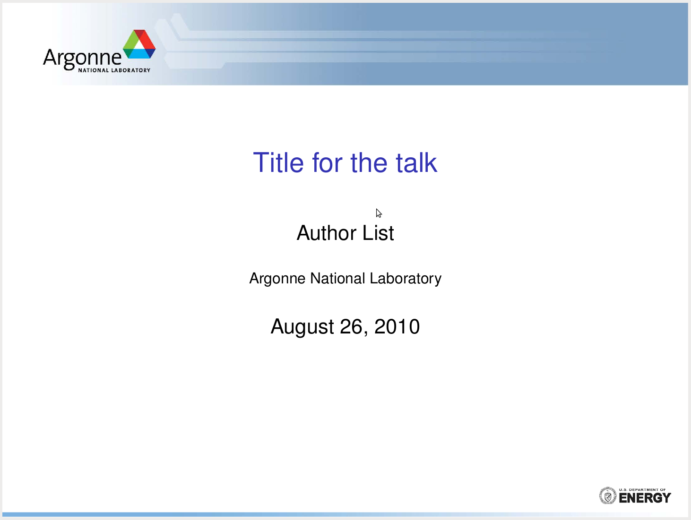

# SlideANL

Personal fork of unofficial LaTeX templates for Argonne use.

## PosterANL

The `poster/` template can be used to build LaTeX `beamer` posters. It's a
slight modification of the `gemini` `beamerposter` theme template.

## Credits
- Anish Athalye - [gemini](https://github.com/anishathalye/gemini)
- Michael Plews and Mark Wolfman - [cabana-tex](https://github.com/CabanaLab/cabana-tex)
- Zhen Xie - [SlideANL.tgz](https://www.mcs.anl.gov/~zhenxie/archive/)
